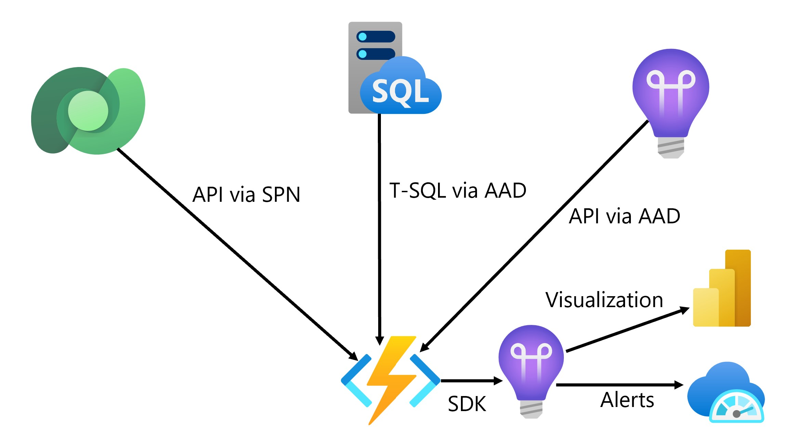

# Disclaimer
```javascript
# This Sample Code is provided for the purpose of illustration only and is not intended to be used in a production environment. 
# THIS SAMPLE CODE AND ANY RELATED INFORMATION ARE PROVIDED "AS IS" WITHOUT WARRANTY OF ANY KIND, EITHER EXPRESSED OR IMPLIED, 
# INCLUDING BUT NOT LIMITED TO THE IMPLIED WARRANTIES OF MERCHANTABILITY AND/OR FITNESS FOR A PARTICULAR PURPOSE. 
# We grant You a nonexclusive, royalty-free right to use and modify the Sample Code and to reproduce and distribute the object code form of the Sample Code, provided that. 
# You agree: 
# (i) to not use Our name, logo, or trademarks to market Your software product in which the Sample Code is embedded; 
# (ii) to include a valid copyright notice on Your software product in which the Sample Code is embedded; 
# and (iii) to indemnify, hold harmless, and defend Us and Our suppliers from and against any claims or lawsuits, including attorneys’ fees, that arise or result from the use or distribution of the Sample Code 
```

# Summary
This repo showcases how to read the async operation table and deliver to Application Insights.

# Architecture


# How to Deploy
1. Clone this repo.
2. Open solution in Visual Studio.
3. Right-click on Microsoft.Dynamics365.OrganizationScanner project.
4. Select Publish.
5. Go through steps to push to Azure Function.

# Example Kusto Query for Async Operations
customEvents
|extend cd = parse_json(customDimensions)
|project JobName_Status = strcat(name , " - ", tostring(cd.StatusName)), toint(cd.StatusCount), timestamp
//|where JobName_Status contains "Retrieve of ayw_"
|render timechart

# Example Kusto Query to Monitor for Exceptions on SQL Query
dependencies 
| where type == 'SQL' and success == false